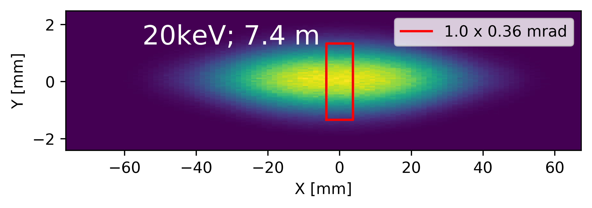
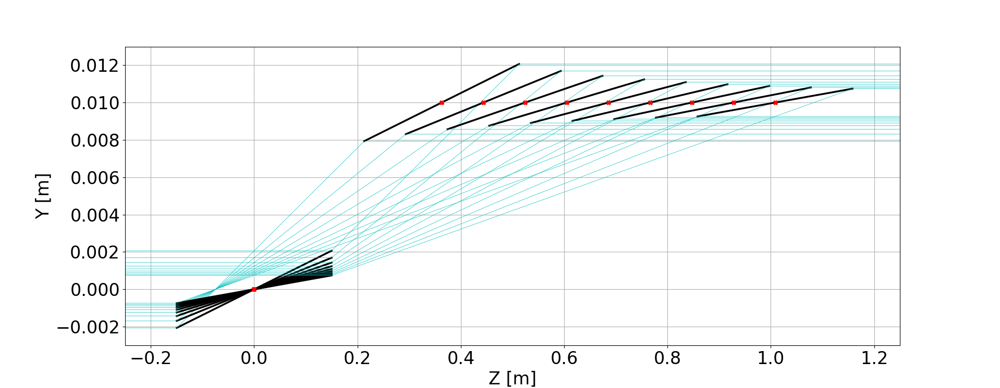

# **BEATS_raytracing**
### This repo contains notebooks and scripts for the raytracing, flux and beam properties calculations for the BEATS TDR

[BEATS](https://beats.esrf.fr/), the BEAmline for Tomography at [SESAME](https://www.sesame.org.jo/) is an H2020 European project to build a beamline for tomography at the SESAME synchrotron in Jordan.

Start here:
- [Notebook #1](BEATS_TDR-Chapter_07f_Optics_Raytracing.ipynb): **BEATS TDR Chapter 07f: Optics - Raytracing.** Expected beam size and coherence properties.

- [Notebook #2](BEATS_TDR-Chapter_07f_Optics_Raytracing-Flux_1mrad.ipynb): Flux through 1mrad compared with other tomography beamlines.

- [Notebook #3](BEATS_TDR-Chapter_07f_Optics_Raytracing-Flux_density.ipynb): Flux density at sample position for White, Pink and monochromatic beam.

___

[DMM folder](DMM) contains scripts to produce plots related to DMM operation such as mirror positions for given grazing, offset and DMM d-spacing or simply plots of the grazing curve and available beam height.

