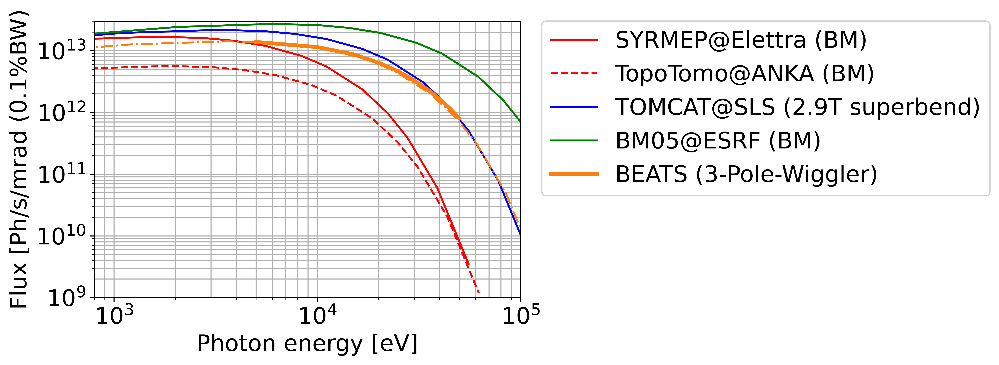

# **BEATS_raytracing**
Raytracing simulations of the [BEATS](https://beats.esrf.fr/) X-ray tomography beamline of [SESAME](https://www.sesame.org.jo/).  

---
#### BEATS TDR notebooks:
- [Notebook #1](BEATS_TDR-Chapter_07f_Optics_Raytracing.ipynb): **BEATS TDR Chapter 07f: Optics - Raytracing.** Expected beam size and coherence properties.

- [Notebook #2](BEATS_TDR-Chapter_07f_Optics_Raytracing-Flux_1mrad.ipynb): Flux through 1mrad compared with other tomography beamlines.

- [Notebook #3](BEATS_TDR-Chapter_07f_Optics_Raytracing-Flux_density.ipynb): Flux density at sample position for White, Pink and monochromatic beam.

___
#### Double Multilayer Monochromator
[DMM folder](DMM): scripts of DMM operation:
- plots of mirror positions for given grazing, offset and DMM d-spacing
- plots of the grazing curve and available beam height

